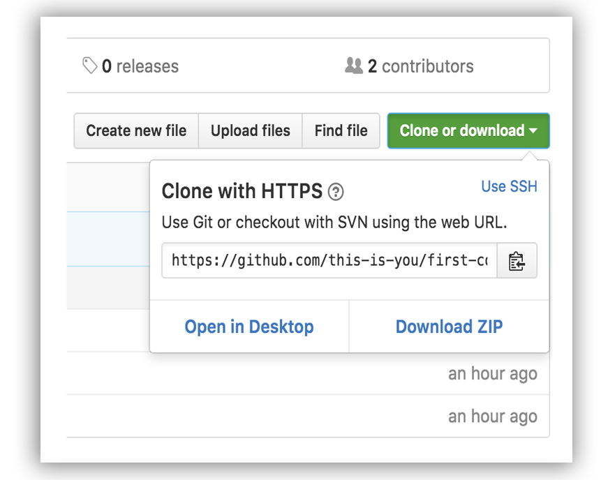

Inspiré par [First Contributions](https://github.com/firstcontributions/first-contributions) de [Roshan Jossey](https://github.com/Roshanjossey)


# Ma première contribution

C'est toujours compliqué la première fois que l'on fait quelque chose. La peur de faire des fautes n'est pas du tout confortable, spécialement quand vous collaborez. Mais le monde du logiciel libre est fait de collaboration et de travail de groupe. Aussi, nous voulons simplifier l'apprentissage des nouveaux contributeurs au logiciel libre en vous enseignant à contribuer pour la première fois.  

Lire des articles et des tutoriels peut aider, mais qu'y a-t-il de mieux que d'essayer sans pouvoir faire d'erreurs ? Ce projet a pour ambition de fournir des conseils et simplifier la manière dont les apprentis font leur première contribution. Souvenez-vous : plus vous êtes serein, mieux vous apprenez. Si vous aspirez à faire votre première contribution, suivez tout simplement les étapes suivantes. Promis, ce sera amusant.


Si vous n'avez pas git sur votre ordinateur, [ installez-le ]( https://help.github.com/articles/set-up-git/ ).

## Embranchez le répertoire (Fork)

Embranchez ce répertoire en cliquant sur le bouton de fork en haut de la page.
Cela va créer une copie du répertoire sur votre compte.

## Clonez le répertoire


Maintenant, clonez ce répertoire sur votre ordinateur. Cliquez sur le bouton clone puis cliquez sur l'icone *copier dans le presse-papier*.

Ouvrez un invite de commande et exécutez les commandes git suivantes :

```
git clone "l'url que vous venez de copier"
```
où "l'url que vous venez de copier" (sans les guillemets) est l'url du répertoire. Voir la section précédente afin d'obtenir l'url.



Par exemple :
```
git clone https://github.com/aitAlmeida/ait.first.contribution.git 
```
où `votre-nom-d-utilisateur` est votre nom d'utilisateur GitHub. Ici vous êtes en train de copier le contenu du répertoire `first-contributions` depuis GitHub sur votre ordinateur.


## Créez une branche

Déplacez-vous dans le répertoire du projet nouvellement cloné (si vous n'y êtes pas encore) :

```
cd ait.first.contributions
```
Maintenant créez une branche avec le commande `git checkout` :
```
git checkout -b <add-votre-nom>
```

Par exemple :
```
git checkout -b add-ait-contrib
```
(Le nom de la branche n'a pas besoin de contenir le terme *add*, mais c'est raisonnable de l'inclure parce que l'objectif de cette branche est d'ajouter votre nom à une liste.)
